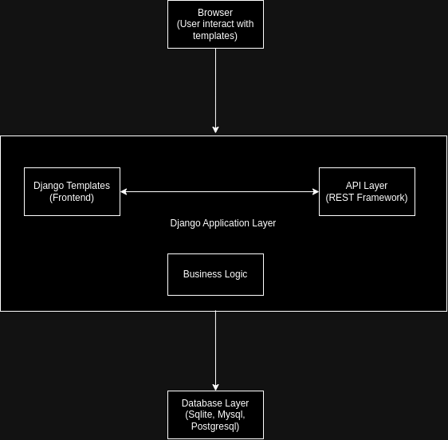

# Django Customer Management Application

## Table of Contents
1. [Overview](#overview)
2. [Tech Stack](#tech-stack)
3. [Getting Started](#getting-started)
   - [Running the Application Without Docker](#running-the-application-without-docker)
   - [Running the Application With Docker Compose](#running-the-application-with-docker-compose)
4. [APIs](#apis)
5. [Design Patterns](#design-patterns)
6. [Architecture Diagram](#architecture-diagram)
7. [Assumptions and Decisions](#assumptions-and-decisions)

---

## Overview
This Django project is a single-page application designed to manage customer data efficiently. Users can securely register, log in, and add or view customer information. JWT authentication ensures that user data is secure, and Docker containerization makes the application portable and consistent across different environments.

## Tech Stack
- **Django**: Handles both backend and frontend logic.
- **OpenAPI Specification**: Defines backend REST APIs for better API documentation and ease of testing.
- **Database**: Initially uses SQLite, but can be replaced with any other relational database.
- **Docker**: Used to containerize the application, making it easier to deploy.
- **GitHub**: Hosts the source code repository.

## Getting Started

### Prerequisites
- **Python 3.8+**
- **Docker and Docker Compose** (if running in Docker)

### Running the Application Without Docker
1. Clone the repository:
    ```bash
    git clone https://github.com/your-repo/customer-management.git
    cd customer-management
    ```

2. Install dependencies:
    ```bash
    pip install -r requirements.txt
    ```

3. Set up the database:
    ```bash
    python manage.py migrate
    ```

4. Run the development server:
    ```bash
    python manage.py runserver
    ```

5. Access the application at `http://127.0.0.1:8000`.

### Running the Application With Docker Compose
1. Clone the repository:
    ```bash
    git clone https://github.com/your-repo/customer-management.git
    cd customer-management
    ```

2. Start the application with Docker Compose:
    ```bash
    docker-compose up --build
    ```

3. Access the application at `http://127.0.0.1:8000`.

To stop the application:
```bash
docker-compose down
```

## APIs

- **`/api/1/login/`**: Log in to the application.
- **`/api/1/logout/`**: Log out from the application.
- **`/api/1/register/`**: Register a new user.
- **`/api/1/customer/create/`**: Create a new customer entry.
- **`/api/1/customer/fetch/`**: Fetch customer data with pagination.

## Design Patterns

### 1. Singleton Pattern
   - **Database Connection**: Django uses a single instance of database connections, making the database a singleton by default.
   - **Settings Module**: The `settings.py` file follows a Singleton pattern by providing a single instance of configurations throughout the application.
   - **Logging**: Django uses a centralized logging configuration, making it accessible as a single instance across the application.

### 2. Decorator Pattern
   - A custom decorator is used to measure the execution time of view functions. It’s applied to views to record how long each API request takes to process.

   ```python
   import time
   from functools import wraps

   def execution_time_logger(func):
       @wraps(func)
       def wrapper(*args, **kwargs):
           start_time = time.time()
           result = func(*args, **kwargs)
           end_time = time.time()
           print(f"{func.__name__} executed in {end_time - start_time} seconds")
           return result
       return wrapper
   ```

### 3. Model-View-Template (MVT) Pattern
   - **Models**: Define the structure and relationships of data (e.g., `Customer` model).
   - **Views**: Handle requests and return responses, either as HTML templates or JSON for APIs.
   - **Templates**: Manage the frontend HTML structure.

## Architecture Diagram

  <!-- Include a diagram illustrating the flow between client, Django views, models, and database -->


## Assumptions and Decisions

1. **JWT Authentication**:
   - JWT tokens are used for secure user authentication, which is stateless and doesn’t require server-side sessions. Each user’s access token is stored client-side and included in requests as a header for API access.

2. **SQLite Database**:
   - Initially, SQLite is used as a lightweight, embedded database for simplicity. The application can be easily reconfigured to use other databases like PostgreSQL or MySQL by modifying the database settings.

3. **Pagination for Customer Data**:
   - The `/api/1/customer/fetch/` endpoint uses pagination to handle large datasets. This ensures efficient data retrieval and response times, especially as the user base and data grow.

4. **Error Handling**:
   - Error responses are designed to be user-friendly and provide specific feedback for invalid or duplicate entries. An error page is displayed when issues occur during data saving.

5. **OpenAPI Specification**:
   - OpenAPI is used to document the APIs, helping developers and clients understand API usage. Documentation is maintained alongside the codebase for consistency.

6. **Docker for Consistency**:
   - Docker ensures that the application runs consistently across different environments. Docker Compose simplifies the setup of dependent services and configurations.

---

This document provides a comprehensive guide to understanding, setting up, and running the Django-based customer management application. The design patterns used ensure modularity, maintainability, and efficiency, making the application scalable as it grows.